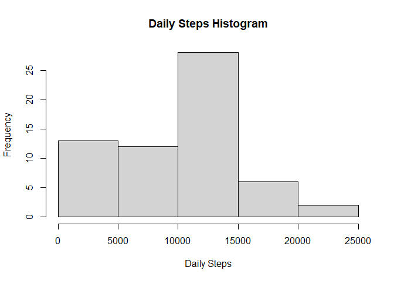
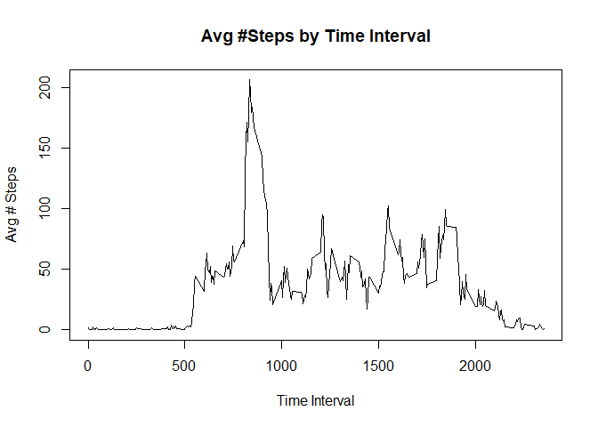
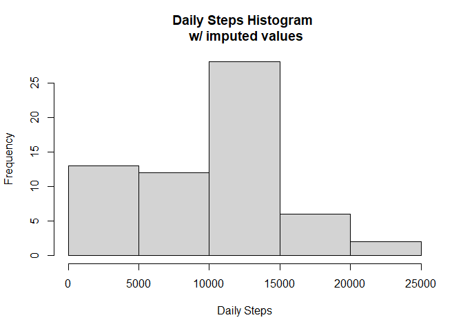
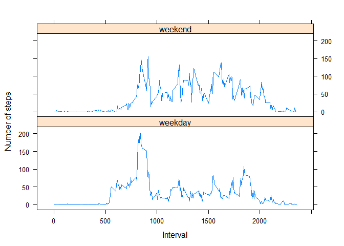

PA1\_template
================
Rodrigo Zuniga

## Loading and preprocessing the data

``` r
rm(list = ls())
setwd("C:\\Users\\rodri\\Dropbox\\Education\\R\\RClass5\\repdata_data_activity")
activity<-read.csv("activity.csv")
```

## What is mean total number of steps taken per day?

``` r
totday<-tapply(activity$steps,FUN=sum,na.rm=T,INDEX=activity$date)
hist(totday,main="Daily Steps Histogram",xlab = "Daily Steps")
```

<!-- -->

``` r
meandailysteps<-mean(totday)
mediandailysteps<-median(totday)
```

  - Mean number of daily steps : 9354  
  - Median number of daily steps : 10395

## What is the average daily activity pattern?

``` r
meanstepsbyinterval<-tapply(activity$steps,FUN=mean,na.rm=T,INDEX=activity$interval)
plot(row.names(meanstepsbyinterval),meanstepsbyinterval,
     ylab = "Avg # Steps",xlab="Time Interval",main="Avg #Steps by Time Interval",
     type="l")
```

<!-- -->

``` r
maxsteps=max(meanstepsbyinterval)
maxinterval<-meanstepsbyinterval[meanstepsbyinterval==maxsteps]
maxintervaltime<-rownames(meanstepsbyinterval)[which(meanstepsbyinterval==maxsteps)]
```

  - Maximum number of steps in interval: `206`
  - Time with maximum number of steps: `835`

## Imputing missing values

``` r
medianstepsbyinterval<-tapply(activity$steps,FUN=median,na.rm=T,INDEX=activity$interval)

medianstepsbyinterval2<-data.frame(mediansteps=medianstepsbyinterval,interval=as.numeric(row.names(medianstepsbyinterval)))

activity2<-dplyr::inner_join(activity,medianstepsbyinterval2,by="interval")

activity2$steps2<-(ifelse(is.na(activity2$steps),activity2$mediansteps,activity2$steps))

totday2<-tapply(activity2$steps2,FUN=sum,na.rm=T,INDEX=activity2$date)

hist(totday2,main="Daily Steps Histogram \n w/ imputed values",xlab = "Daily Steps")
```

<!-- -->

``` r
oldmean<-mean(totday)
newmean<-mean(totday2)

oldmedian<-median(totday)
newmedian<-median(totday2)
```

  - mean before imputation: `9354`

  - mean after imputation: `9504`

  - median before imputation: `10395`

  - median after imputation: `10395`

## Are there differences in activity patterns between weekdays and weekends?

``` r
library(lattice)
activity2$weekpart<-factor(ifelse(weekdays(as.Date(activity2$date))%in%c("Saturday","Sunday"),"weekend"
                                  ,"weekday"))
weekpartsteps<-aggregate(activity2$steps2,FUN=mean,by = list(interval=activity2$interval,weekpart=activity2$weekpart))
weekpartsteps<-dplyr::rename(weekpartsteps,steps=x)

xyplot(steps~interval|weekpart,data=weekpartsteps,type="l",layout=c(1,2),xlab = "Interval",ylab="Number of steps")
```

<!-- -->
